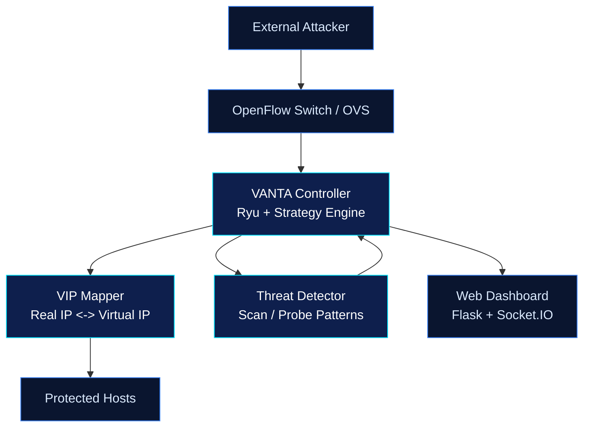

<p align="center">
  
</p>

<p align="center">
  <a href="https://github.com/">
    
  </a>
</p>

<p align="center">
  
  
  
  
</p>

# VANTA
Adaptive SDN-based Moving Target Defense (MTD) focused on invalidating attacker scan results through fast virtual IP (VIP) morphing.

## Why VANTA
External reconnaissance should become stale almost immediately.

| Phase | Device 1 | Device 2 (Vulnerable Device) |
|---|---|---|
| Scan output (t0) | `192.168.13.2` | `192.168.13.66` |
| After morph (t0 + ~1s) | `192.168.13.56` | `192.168.13.45` |

## Minimal Architecture


## How It Works
1. Hosts keep stable real identities internally.
2. Controller assigns attacker-facing VIPs.
3. Recon behavior is detected (for example rapid unique-port probes).
4. When scan activity goes idle (for example ~1 second), VIP mappings are shuffled.
5. Old attacker intel is invalidated; dashboard reflects the new map in real time.

## Project Scope (Primary Variant)
All active work is centered on `27/02/26/`.

```text
27/02/26/
+-- ultimate_mtd_controller.py   # Main Ryu + Flask controller
+-- attack_simulator.py          # Adversarial scenarios
+-- benchmark_suite.py           # Performance evaluation
+-- quick_start.md               # Run steps
+-- project_overview.md          # Research framing
+-- templates/
    +-- login.html
    +-- dashboard_ultimate.html
```

## Core Capabilities
- OpenFlow 1.3 SDN control plane (Ryu).
- VIP allocation and morphing.
- Strategy modes: reply, time, packet-count, threat-triggered, manual.
- Port-scan-oriented threat detection.
- Real-time dashboard updates via WebSocket.
- Authentication and session handling.
- CSV/JSON/PDF exports.

## Quick Start
```bash
# 1) Install dependencies
pip install ryu rich flask flask-socketio flask-login eventlet reportlab pandas scapy matplotlib seaborn psutil

# 2) Start controller
ryu-manager ultimate_mtd_controller.py

# 3) Start Mininet (new terminal)
sudo mn --controller=remote,port=6653 --topo=single,3 --mac

# 4) Open dashboard
http://localhost:5000
default: admin / mtd2024
```

## API Surface
| Endpoint | Method | Purpose |
|---|---|---|
| `/api/stats` | `GET` | Runtime metrics and event history |
| `/api/mappings` | `GET` | Current real-to-VIP map |
| `/api/strategy` | `GET/POST` | Read or update strategy config |
| `/api/morph/force` | `POST` | Trigger immediate morph |
| `/api/export/csv` | `GET` | Download morph history |
| `/api/export/json` | `GET` | Download full stats |
| `/api/export/pdf` | `GET` | Download PDF report |

## Experiment Checklist
- `python 27/02/26/attack_simulator.py --attack port_scan --target 10.0.0.2`
- `python 27/02/26/benchmark_suite.py --test latency`
- `python 27/02/26/benchmark_suite.py --test strategy_comparison`

## Metrics to Report
- Security: attack success reduction, scan completeness degradation, detection-to-morph delay.
- Performance: RTT/throughput overhead, CPU/memory usage, flow churn.

## Notes
- `benchmark_suite.py` assumes Linux/Mininet tools (`ping -c`, `iperf`).
- VANTA objective: force attacker reconnaissance data to expire faster than exploitation cycles.