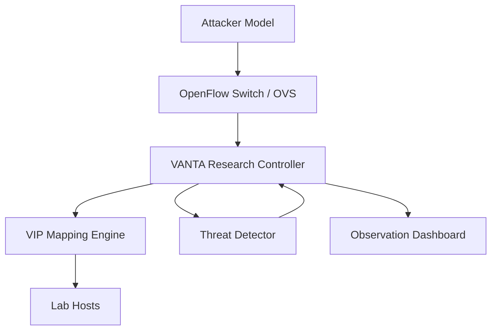

<p align="center">
  
</p>

<p align="center">
  
  
  
</p>

# VANTA
Variable Network Topology Architecture (VANTA) is a research-oriented SDN testbed for studying moving target defense through virtual IP morphing, scan-triggered remapping, and controlled attacker-observer experiments.

## Research Goal
VANTA is designed for academic evaluation, not production deployment. The project studies how quickly attacker reconnaissance becomes stale when host-facing identifiers are remapped under different morphing strategies and threat conditions.

## Research Questions
1. How much does virtual IP morphing reduce the usefulness of reconnaissance output?
2. Which morphing strategy gives the best security-performance trade-off in a lab network?
3. How quickly should remapping occur after suspicious probing to invalidate attacker knowledge?

## Core Hypothesis
If an SDN controller remaps attacker-visible identities often enough, then scan results lose value before they can reliably support follow-on exploitation.

## Minimal Architecture


## Research Scope
- SDN controller for OpenFlow 1.3 experiments using Ryu.
- Dynamic VIP allocation and remapping to invalidate stale attacker observations.
- Morphing strategies including reply-triggered, time-based, packet-count-based, randomized, and threat-triggered remapping.
- Attack simulation scripts for scan and flood style traffic.
- Benchmark tooling for latency, throughput, and strategy comparison.
- Dashboard and export endpoints used as observation tooling during experiments.

## Repository Layout
```text
.
+-- ultimate_mtd_controller.py
+-- attack_simulator.py
+-- benchmark_suite.py
+-- compare_architecture.py
+-- compare_modern_architectures.py
+-- quick_start.md
+-- project_overview.md
+-- requirements.txt
+-- vanta_core/
+-- tests/
```

## Reproducible Workflow
1. Install dependencies and start the controller.
2. Launch a Mininet topology connected to the controller.
3. Generate baseline traffic between hosts.
4. Run one or more attack simulations.
5. Record morph events, scan detections, and timing data.
6. Compare strategy behavior with the benchmark suite.

Detailed instructions are in [quick_start.md](quick_start.md) and [project_overview.md](project_overview.md).

## Experiment Profiles
VANTA now frames runtime modes as experiment profiles:
- `baseline`: low-complexity lab reproduction with minimal assumptions.
- `adaptive`: comparative study mode with remote-observer and trust-aware signals enabled.
- `stress`: high-pressure evaluation profile for aggressive control-plane experiments.

Legacy values such as `lab`, `hybrid`, and `enterprise` are still accepted for compatibility.

## Suggested Metrics
- Detection-to-morph delay
- Reconnaissance degradation
- Address stability half-life
- RTT overhead
- Throughput impact
- CPU and memory usage
- Flow churn and controller event rate

## Limitations
- The intended execution environment is Linux with Mininet, Open vSwitch, and Ryu.
- The dashboard is an experimental observation interface, not an operations console.
- Authentication and policy helpers exist to model control-plane conditions during experiments, not to represent hardened enterprise security.

## Validation
```bash
python -m unittest discover -s tests -v
python benchmark_suite.py --test latency
python benchmark_suite.py --test strategy_comparison
```

## License
- [Apache 2.0](https://github.com/Manishsarkar1/VANTA-Variable-Network-Topology-Architecture-/blob/prime/LICENSE)
