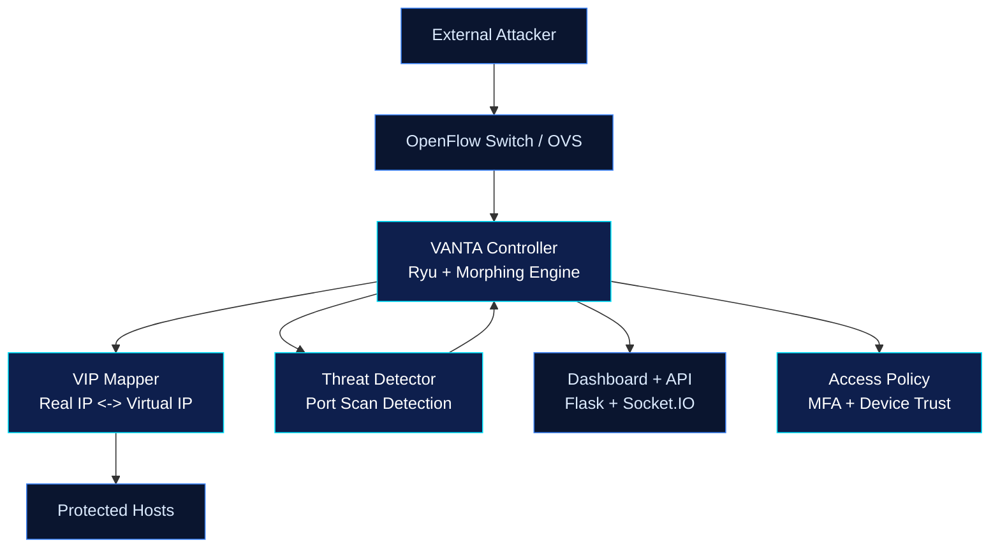

<p align="center">
  
</p>

<p align="center">
  <a href="https://github.com/">
    
  </a>
</p>

<p align="center">
  
  
  
  
</p>

# VANTA
Variable Network Topology Architecture (VANTA) is an SDN-based Moving Target Defense research prototype that uses virtual IP (VIP) remapping, threat-triggered morphing, and a live dashboard to make reconnaissance data go stale quickly.

## Why VANTA
Traditional static addressing gives attackers a reliable map of hosts and services. VANTA reduces that advantage by changing attacker-facing identities after communication events, on schedule, after packet thresholds, or immediately when suspicious scan behavior is detected.

| Phase | Device 1 | Vulnerable Device |
|---|---|---|
| Scan output (t0) | `192.168.13.2` | `192.168.13.66` |
| After morph (t0 + ~1s) | `192.168.13.56` | `192.168.13.45` |

## Minimal Architecture


## Documentation
- [Quick Start Guide](quick_start.md)
- [Project Overview](project_overview.md)

## Project Scope
```text
.
+-- ultimate_mtd_controller.py
+-- attack_simulator.py
+-- benchmark_suite.py
+-- compare_architecture.py
+-- compare_modern_architectures.py
+-- quick_start.md
+-- project_overview.md
+-- requirements.txt
+-- vanta_core/
+-- tests/
+-- start_dashboard.sh
+-- README.md
```

## Core Capabilities
- OpenFlow 1.3 controller built on Ryu for SDN experimentation.
- Network adapter seam for future hardware backends, so morphing logic can be carried forward beyond Mininet-centric labs.
- Dynamic VIP allocation and IP-pair morphing to invalidate stale scan results.
- Multiple morphing modes: reply-triggered, time-based, packet-count-based, randomized intervals, threat-triggered, and operator-forced morphing.
- Port-scan detection with configurable threshold/window logic.
- Web dashboard with live topology, mappings, morph history, and trigger statistics over Socket.IO.
- Login flow with MFA validation, simple zero-trust access decisions, and device-trust-aware control-plane access.
- Deployment profiles for `lab`, `hybrid`, and `enterprise` modes.
- Export support for CSV, JSON, and PDF reports.
- Attack simulation and performance benchmarking utilities for experiments.

## Scalability And Production Readiness
- Ryu remains a single-node research controller, so true horizontal scale still requires porting the morphing engine to a clustered SDN control plane such as ONOS or OpenDaylight.
- This repo now includes a Redis-backed VIP mapper for crash resilience. The controller still runs as one Ryu instance, but active VIP assignments can survive a controller restart as long as the Redis lease has not expired.
- VIP persistence TTL is aligned to the active morph interval when time-based morphing is enabled, and falls back to `VANTA_VIP_PERSISTENCE_TTL_SECONDS` for reply-triggered or threat-triggered deployments.
- The controller now has a pluggable network backend boundary. `ryu_openflow` is the active adapter today, while `openflow_hardware`, `netconf`, and `p4runtime` are scaffolded as planned backends for product-grade switch integration.
- `openflow_hardware` is now a real adapter for OpenFlow-capable switches and bare-metal OVS endpoints. It keeps device inventory, requests port descriptions, exposes capability metadata, and uses the same flow-programming path against non-Mininet datapaths.
- `openflow_hardware` now reads [config/hardware_inventory.json](/C:/Users/sarka/OneDrive/Desktop/minor/VANTA-Variable-Network-Topology-Architecture-/config/hardware_inventory.json) and enforces per-switch rollout policy before enabling non-bootstrap flow programming.
- Runtime state now persists to SQLite by default, including morph history, threat events, audit logs, and current VIP mappings.

## Quick Start
```bash
# 1) Install Python dependencies
pip install -r requirements.txt
pip install pandas scapy matplotlib seaborn psutil

# Optional: override demo credentials and deployment mode
# Linux/macOS:
export VANTA_SECRET_KEY='replace-this-secret'
export VANTA_ADMIN_USERNAME='admin'
export VANTA_ADMIN_PASSWORD='replace-this-password'
export VANTA_MFA_CODE='246810'
export VANTA_DEPLOYMENT_MODE='hybrid'
export VANTA_NETWORK_BACKEND='ryu_openflow'
export VANTA_NETWORK_TARGET='mininet'
export VANTA_VIP_MAPPING_BACKEND='memory'

# Windows PowerShell:
$env:VANTA_SECRET_KEY='replace-this-secret'
$env:VANTA_ADMIN_USERNAME='admin'
$env:VANTA_ADMIN_PASSWORD='replace-this-password'
$env:VANTA_MFA_CODE='246810'
$env:VANTA_DEPLOYMENT_MODE='hybrid'
$env:VANTA_NETWORK_BACKEND='ryu_openflow'
$env:VANTA_NETWORK_TARGET='mininet'
$env:VANTA_VIP_MAPPING_BACKEND='memory'

# 2) Start the VANTA controller and dashboard backend
ryu-manager ultimate_mtd_controller.py

# 3) Start Mininet in a new terminal
sudo mn --controller=remote,port=6653 --topo=single,3 --mac

# 4) Open the dashboard
# http://localhost:5000
# default login: admin / mtd2024
# demo MFA code: 246810
```

## Product-Oriented Install
```bash
# Local install
pip install .

# Run the controller through the packaged CLI
vanta controller

# Or directly
vanta-controller
```

### Docker Startup
```bash
docker build -t vanta:latest .
docker run --rm -p 5000:5000 -p 6653:6653 vanta:latest
```

### Redis-backed VIP Persistence
```bash
# Start Redis if you want crash-resilient VIP mappings
docker run --name vanta-redis -p 6379:6379 redis:7

# Linux/macOS:
export VANTA_VIP_MAPPING_BACKEND='redis'
export VANTA_REDIS_URL='redis://localhost:6379/0'
export VANTA_VIP_PERSISTENCE_TTL_SECONDS='60'

# Windows PowerShell:
$env:VANTA_VIP_MAPPING_BACKEND='redis'
$env:VANTA_REDIS_URL='redis://localhost:6379/0'
$env:VANTA_VIP_PERSISTENCE_TTL_SECONDS='60'
```

### Network Backend Abstraction
```bash
# Current lab default
export VANTA_NETWORK_BACKEND='ryu_openflow'
export VANTA_NETWORK_TARGET='mininet'
export VANTA_HARDWARE_INVENTORY_PATH='config/hardware_inventory.json'
export VANTA_HARDWARE_ROLLOUT_MODE='enforce'
export VANTA_STATE_BACKEND='sqlite'
export VANTA_STATE_DB_PATH='data/vanta.db'

# Real OpenFlow hardware path
export VANTA_NETWORK_BACKEND='openflow_hardware'
export VANTA_NETWORK_TARGET='bare_metal_ovs'

# Example vendor-target labels for inventory and rollout policy
export VANTA_NETWORK_TARGET='cisco_catalyst'
```

### Hardware Rollout Policy
- Devices are blocked by default until explicitly approved in [config/hardware_inventory.json](/C:/Users/sarka/OneDrive/Desktop/minor/VANTA-Variable-Network-Topology-Architecture-/config/hardware_inventory.json).
- `mode=enforce` blocks non-bootstrap flow programming on unapproved switches.
- `mode=audit` logs policy violations but still allows flow installation for staged rollouts.
- Per-device policy can require specific OpenFlow capabilities, a minimum discovered port count, and flow constraints such as max idle timeout or disallowing buffer IDs.

### Operator Onboarding Flow
- Discover connected hardware with `GET /api/network/devices`.
- Approve a device without editing JSON manually by calling `POST /api/network/onboard/<dpid>`.
- Move one switch from `audit` to `enforce` with `POST /api/network/rollout/<dpid>`.
- Every onboarding or rollout change is written to the audit log and persisted in SQLite by default.

### State Persistence
- Default runtime persistence uses SQLite at `data/vanta.db`.
- Persisted tables include morph events, threat events, audit logs, and the current VIP mapping set used for bootstrap restore.
- Override the backend/path with `VANTA_STATE_BACKEND` and `VANTA_STATE_DB_PATH`.

## API Surface
| Endpoint | Method | Purpose |
|---|---|---|
| `/api/stats` | `GET` | Controller stats, threat history, protocol counts, and recent morph events |
| `/api/mappings` | `GET` | Current real-IP to VIP assignments |
| `/api/strategy` | `GET/POST` | Read or update active morphing strategy settings |
| `/api/morph/force` | `POST` | Force immediate morphing of active IP pairs |
| `/api/access/context` | `GET` | Current access-control context and last policy decision |
| `/api/audit/logs` | `GET` | Recent audit log entries, including hardware onboarding and rollout changes |
| `/api/network/devices` | `GET` | Current switch inventory, discovered OpenFlow capabilities, and known port metadata |
| `/api/network/onboard/<dpid>` | `POST` | Approve a specific hardware switch and persist its expected capabilities and rollout mode |
| `/api/network/rollout/<dpid>` | `POST` | Change one approved switch between `audit` and `enforce` rollout modes |
| `/api/deployment/profile` | `GET` | Active deployment profile metadata |
| `/api/health` | `GET` | Service health, deployment mode, telemetry level, and active network backend metadata |
| `/api/export/csv` | `GET` | Export morph history as CSV |
| `/api/export/json` | `GET` | Export controller statistics as JSON |
| `/api/export/pdf` | `GET` | Export a PDF summary report |

## Experiment Checklist
- `python attack_simulator.py --attack port_scan --target 10.0.0.2`
- `python attack_simulator.py --attack reconnaissance --target 10.0.0.2`
- `python benchmark_suite.py --test latency`
- `python benchmark_suite.py --test throughput`
- `python benchmark_suite.py --test strategy`
- `python -m unittest discover -s tests -v`

## Metrics to Report
- Security: scan detection accuracy, reconnaissance degradation, detection-to-morph delay, and attacker view instability.
- Performance: RTT overhead, throughput impact, CPU/memory consumption, and controller event volume.

## Notes
- Primary runtime target is Linux, Mininet, Open vSwitch, and Ryu; some scripts can be read on Windows, but full SDN execution is lab-oriented.
- `attack_simulator.py` includes `port_scan`, `syn_flood`, `ping_flood`, `reconnaissance`, and `all` attack modes.
- `benchmark_suite.py` relies on tools such as `ping` and `iperf`, and works best in a Mininet-capable environment.
- The `vanta_core` package contains reusable policy, config, deployment, and defense logic covered by unit tests.
- VANTA's research goal is to keep attacker reconnaissance data outdated long enough to reduce follow-on exploitation value.

## License
- [Apache 2.0](https://github.com/Manishsarkar1/VANTA-Variable-Network-Topology-Architecture-/blob/prime/LICENSE)
