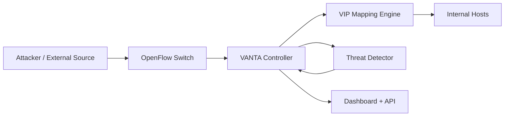

# VANTA Project Overview

## Title
VANTA: Variable Network Topology Architecture - An adaptive SDN-based Moving Target Defense (MTD) system with virtual IP morphing and threat-triggered response.

## Problem Statement
Static network addressing gives attackers a stable target map. Once reconnaissance completes, exploitation becomes easier because host-to-IP relationships remain valid for too long.

## Core Idea
VANTA continuously virtualizes and remorphs attacker-facing IP identities so reconnaissance data expires quickly.

Example:
- At `t0`: scanner sees `192.168.13.2` and `192.168.13.66`
- At `t0 + ~1s` after scan inactivity: same hosts become `192.168.13.56` and `192.168.13.45`

## Objectives
1. Implement SDN-driven VIP mapping and fast IP morphing.
2. Detect scan-like behavior and trigger defensive remorphing.
3. Provide real-time visibility through a dashboard.
4. Measure security gain vs performance overhead.

## System Components
- `ultimate_mtd_controller.py`
  - Ryu control plane
  - VIP allocator and morph logic
  - Threat detector
  - Flask + Socket.IO dashboard and APIs
- `attack_simulator.py`
  - Attack traffic generation (scan/flood/recon scenarios)
- `benchmark_suite.py`
  - Latency, throughput, CPU/memory, strategy comparisons

## Architecture

## Threat Model
VANTA currently targets:
- Port scanning / reconnaissance behavior.
- Rapid probing patterns that build host-service intelligence.

## Morphing Strategies
- Reply-triggered: morph after completed communication patterns.
- Time-based: periodic remorphing.
- Packet-count-based: remorph after traffic thresholds.
- Threat-triggered: immediate remorphing on suspicious probes.
- Manual: operator-triggered morph.

## Evaluation Plan
Security metrics:
- Scan completion quality degradation.
- Attack success-rate reduction.
- Detection-to-morph delay.

Performance metrics:
- RTT and throughput overhead.
- Controller CPU and memory usage.
- Flow churn / control-plane load.

## Research Questions
1. How much does VIP morphing reduce usable reconnaissance output?
2. Which strategy offers the best security/performance trade-off?
3. What morph interval keeps attacker knowledge stale with acceptable overhead?

## Deliverables
- Working SDN MTD controller.
- Attack simulation suite.
- Benchmarking suite.
- Dashboard and export endpoints.
- Reproducible experiment data.

## Practical Notes
- Primary runtime target is Linux + Mininet + OVS.
- Keep controller execution via `ryu-manager ultimate_mtd_controller.py`.
- Use `quick_start.md` for run commands and troubleshooting.