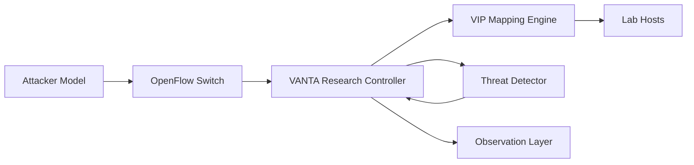

# VANTA Project Overview

## Title
VANTA: Variable Network Topology Architecture for research on SDN-based moving target defense.

## Problem Framing
Static addressing gives an attacker a stable network map. In a research setting, that makes it difficult to measure how quickly a defender can invalidate reconnaissance without imposing excessive control-plane cost.

## Research Position
This repository should be treated as an experimental platform. Its purpose is to help researchers, students, and evaluators reproduce controlled lab studies on virtual IP morphing rather than to offer a production-ready network defense stack.

## Core Idea
VANTA continuously remaps attacker-visible identities so that observations collected at time `t0` become unreliable at `t1`.

Example:
- At `t0`, a scanner sees `192.168.13.2` and `192.168.13.66`.
- At `t1`, after morphing is triggered, the same hosts may appear as `192.168.13.56` and `192.168.13.45`.

## Objectives
1. Build an SDN controller that supports controlled VIP morphing experiments.
2. Detect scan-like behavior and study trigger-driven remapping.
3. Observe system behavior through logs, APIs, and dashboard telemetry.
4. Quantify security benefit versus experimental overhead.

## Main Components
- `ultimate_mtd_controller.py`
  Research controller combining Ryu, VIP mapping, morph scheduling, threat detection, and observation endpoints.
- `attack_simulator.py`
  Traffic generator for reconnaissance and disruption scenarios.
- `benchmark_suite.py`
  Measurement harness for latency, throughput, resource use, and strategy comparison.
- `vanta_core/`
  Reusable experiment logic including policy, config, deployment profile mapping, and defense primitives.
- `tests/`
  Unit tests for core research logic.

## Architecture

## Threat Model
VANTA focuses on early-stage adversarial behavior:
- Port scans and host/service discovery.
- Rapid probing patterns that build targeting intelligence.

## Experimental Factors
- Morphing strategy
- Morph interval
- Packet threshold
- Threat trigger sensitivity
- Topology size
- Attack intensity

## Candidate Dependent Variables
- Detection-to-morph delay
- Reconnaissance accuracy after remapping
- Flow churn
- Controller CPU and memory usage
- Latency and throughput overhead

## Experiment Profiles
- `baseline`
  Controlled reproduction mode for simple lab runs.
- `adaptive`
  Comparative mode for experiments that include richer trust and access signals.
- `stress`
  High-pressure mode for aggressive remapping and heavier observation overhead.

Legacy profile names are still accepted for compatibility with older scripts.

## Deliverables
- A working research controller
- Attack and benchmark scripts
- Reproducible lab instructions
- Measurable telemetry for comparative analysis

## Practical Notes
- The primary runtime target is Linux with Mininet and Open vSwitch.
- Use `ryu-manager ultimate_mtd_controller.py` to run the controller.
- Use `quick_start.md` as the experiment reproduction guide.
